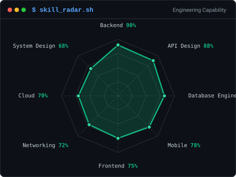
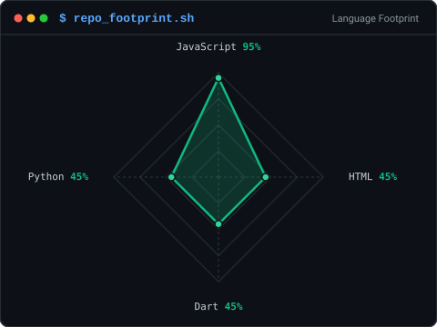
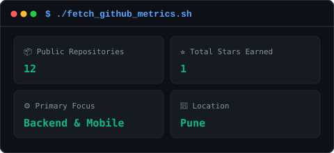
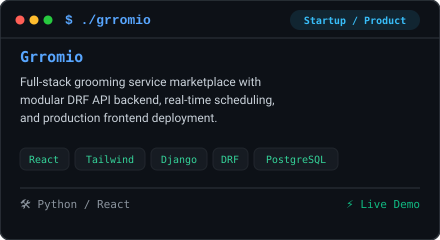
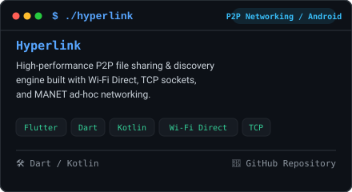
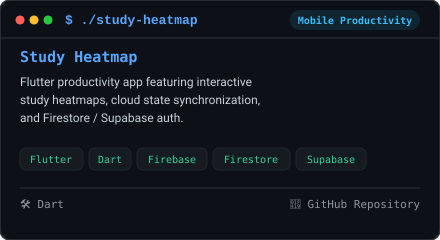
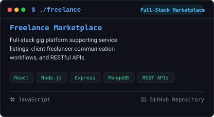

<div align="center">
  

  <br />

  <a href="https://github.com/Saidom0423">
    
  </a>

  <p>
    Final Year CSE Student @ Pimpri Chinchwad University, Pune<br/>
    Specializing in backend-heavy architecture, RESTful API design, mobile apps, and distributed networking.
  </p>

  <p>
    <a href="https://www.linkedin.com/in/sai-dom-478449289"></a>
    <a href="https://github.com/Saidom0423"></a>
    <a href="mailto:saidom0423@gmail.com"></a>
  </p>
</div>

---

## `~/` whoami

```console
$ cat about.txt
```

> I am a Computer Science & Engineering student based in Pune, India. I specialize in building backend-heavy applications, robust REST APIs, cross-platform mobile apps, and peer-to-peer networking solutions. My engineering focus centers on clean API contracts, database schema optimization, distributed systems, and shipping production-ready products.

```text
Currently building:
- Grromio        -> Full-stack grooming service marketplace backend & web app
- Hyperlink      -> High-speed P2P ad-hoc file transfer engine on Android (Flutter/Wi-Fi Direct)
- Study Heatmap  -> Cross-platform productivity & habit tracker with cloud synchronization
```

---

## `~/` toolbox

```console
$ ./list_skills.sh --all
```

### Languages & Backend
<p>
  
  
  
  
  
  
  
  
</p>

### Frontend & Mobile
<p>
  
  
  
  
  
</p>

### Databases & Cloud Tools
<p>
  
  
  
  
  
  
  
</p>

---

## `~/` skill radar

<table>
<tr>
<td width="50%" align="center">
  <h3>Engineering Capability</h3>
  <picture>
    <source media="(prefers-color-scheme: dark)" srcset="assets/radar-dark.svg" />
    <source media="(prefers-color-scheme: light)" srcset="assets/radar-light.svg" />
    
  </picture>
</td>
<td width="50%" align="center">
  <h3>Repository Language Footprint</h3>
  <picture>
    <source media="(prefers-color-scheme: dark)" srcset="assets/radar-langs-dark.svg" />
    <source media="(prefers-color-scheme: light)" srcset="assets/radar-langs-light.svg" />
    
  </picture>
</td>
</tr>
</table>

---

## `~/` contribution activity

<div align="center">
  <picture>
    <source media="(prefers-color-scheme: dark)" srcset="https://raw.githubusercontent.com/Saidom0423/Saidom0423/output/snake-dark.svg" />
    <source media="(prefers-color-scheme: light)" srcset="https://raw.githubusercontent.com/Saidom0423/Saidom0423/output/snake.svg" />
    
  </picture>
</div>

---

## `~/` the numbers

<div align="center">
  <picture>
    <source media="(prefers-color-scheme: dark)" srcset="assets/stats-dark.svg" />
    <source media="(prefers-color-scheme: light)" srcset="assets/stats-light.svg" />
    
  </picture>
</div>

---

## `~/` selected work

<table>
<tr>
<td width="50%" align="center">
  <a href="https://github.com/Saidom0423/Grromio">
    <picture>
      <source media="(prefers-color-scheme: dark)" srcset="assets/cards/grromio-dark.svg" />
      <source media="(prefers-color-scheme: light)" srcset="assets/cards/grromio-light.svg" />
      
    </picture>
  </a>
</td>
<td width="50%" align="center">
  <a href="https://github.com/Saidom0423/Hyperlink">
    <picture>
      <source media="(prefers-color-scheme: dark)" srcset="assets/cards/hyperlink-dark.svg" />
      <source media="(prefers-color-scheme: light)" srcset="assets/cards/hyperlink-light.svg" />
      
    </picture>
  </a>
</td>
</tr>
<tr>
<td width="50%" align="center">
  <a href="https://github.com/Saidom0423/study_heatmap">
    <picture>
      <source media="(prefers-color-scheme: dark)" srcset="assets/cards/study-heatmap-dark.svg" />
      <source media="(prefers-color-scheme: light)" srcset="assets/cards/study-heatmap-light.svg" />
      
    </picture>
  </a>
</td>
<td width="50%" align="center">
  <a href="https://github.com/Saidom0423/freelance-marketplace">
    <picture>
      <source media="(prefers-color-scheme: dark)" srcset="assets/cards/freelance-dark.svg" />
      <source media="(prefers-color-scheme: light)" srcset="assets/cards/freelance-light.svg" />
      
    </picture>
  </a>
</td>
</tr>
</table>

---

## `~/` more work

- 🎓 **[Scholar AI](https://github.com/Saidom0423/scholar_ai)** - Full-stack academic assistant platform integrating Flutter mobile client & Python backend.
- ✍️ **[Document Signature App](https://github.com/Saidom0423/document-signature-app)** - Digital document signing tool built with JavaScript, HTML canvas, and Express API.
- 🧠 **[Feedforward](https://github.com/Saidom0423/Feedforward)** - Deep learning neural network experiments and Python feedback loops.

---

<div align="center">
  <p>
    <code>[SYSTEM STATUS: ONLINE]</code> • <code>[SHELL: ZSH/BASH]</code> • <code>[LOCATION: PUNE, IN]</code>
  </p>
  <sub>Built with automated SVG generation &amp; GitHub Actions • Designed for <a href="https://github.com/Saidom0423">Saidom0423</a></sub>
</div>
